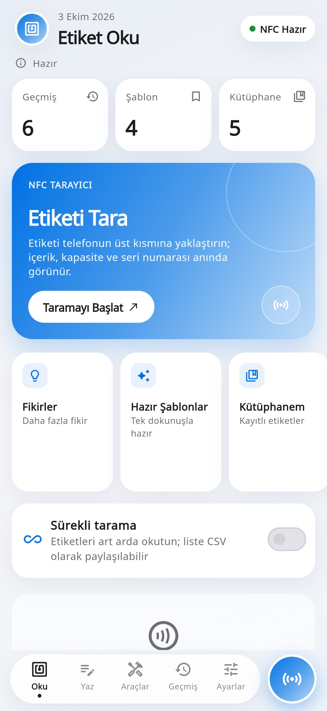
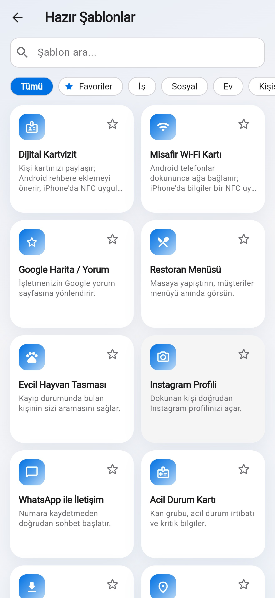
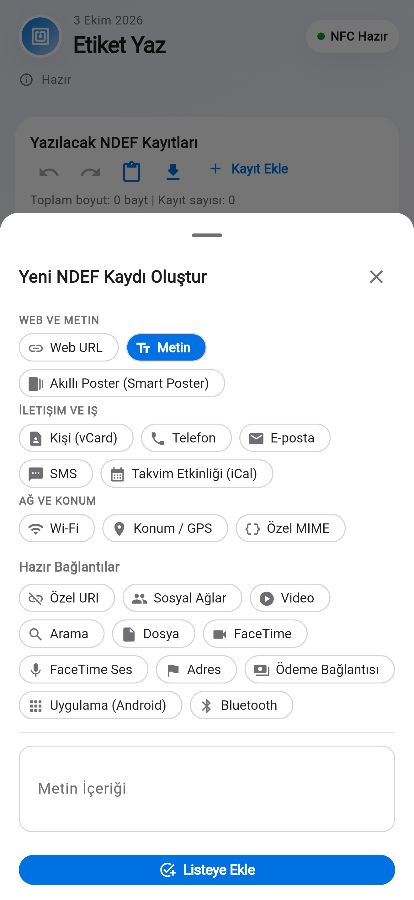
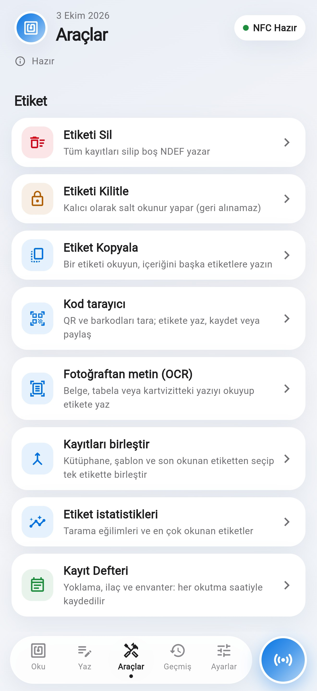
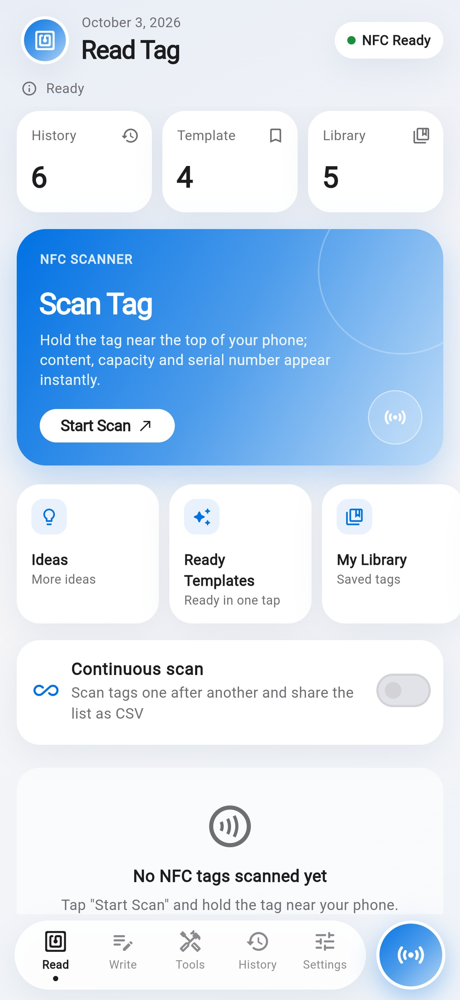
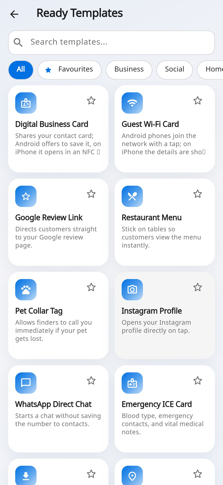
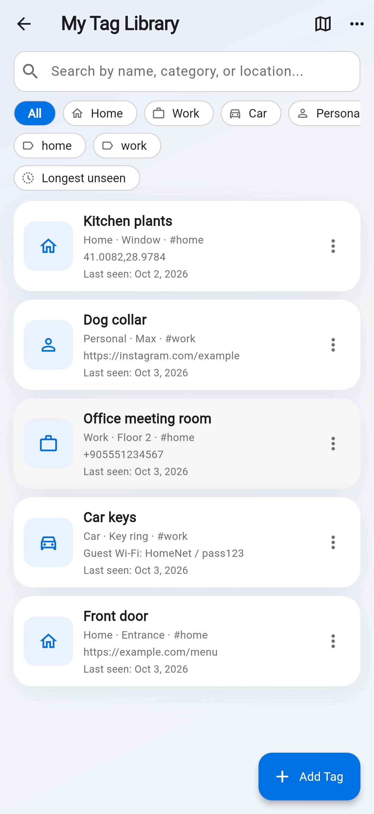
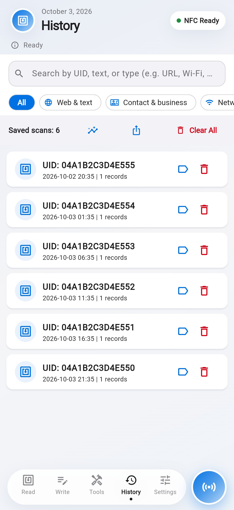

<div align="center">

# NFC Etiket Yöneticisi · NFC Tag Master

**NFC etiketlerini okuyun, yazın, yönetin — ve her gün işinize yarayan araçlar.**
Hesap yok, reklam yok, takip yok. Verileriniz cihazınızda kalır.


[](https://github.com/Bluetwinklez/app-/actions/workflows/ci.yml)






</div>

---

## İçindekiler

- [Özellikler](#özellikler)
- [Gizlilik ve güvenlik](#gizlilik-ve-güvenlik)
- [Gereksinimler](#gereksinimler)
- [Geliştirme](#geliştirme)
- [CI ve yayın](#ci-ve-yayın)
- [Bilinen sınırlar](#bilinen-sınırlar)
- [English](#english)

## Özellikler

### 📡 Okuma
- İçerik, UID, çip tahmini (NTAG213/215/216, Ultralight), üretici, kapasite, yazılabilirlik
- **Etiket raporu:** NDEF biçimi, kilit bitleri, şifre koruması
- **Etiket sağlık testi:** 0–100 puan; boş alan, kilit, tehlikeli bağlantı, imza ve kopya şüphesi için öneriler
- İki etiketi karşılaştırma, sürekli tarama (CSV), dijital kartvizit görünümü, sesli okuma

### ✍️ Yazma
- Metin, URL, e-posta, telefon, SMS, konum (adresle arama), vCard, takvim, Wi-Fi, Smart Poster, uygulama ve sosyal bağlantılar
- **27 hazır şablon:** misafir Wi-Fi, Google yorum, menü, evcil hayvan künyesi, acil durum kartı…
- **"Dokununca ne olur?"** önizlemesi: iPhone ve Android'in etikete ne yapacağı
- Doğrulamalı yazma, kapasite uyarısı, `{date}` `{time}` `{counter}` değişkenleri
- Toplu yazma (seri numara, CSV'den her satır bir etiket), etiket kopyalama, kayıt birleştirme

### 🧰 Araçlar
- Temizleme, kilitleme, NTAG şifresi, bellek okuma/yazma, ham komutlar, NDEF Doktoru
- QR ve barkod tarayıcı, fotoğraftan metin okuma (OCR), istatistikler
- İmzalı etiketler (HMAC-SHA256) ve sahte site uyarısı
- **Hazine avı:** ipuçlarını etiketlere yaz, oyuncular sırayla bulsun, süre tutulsun

### 🗂️ Kütüphane ve kayıt defterleri
- Etiketlere isim, fotoğraf, konum, not, kategori, etiket; harita görünümü
- Demirbaş bilgileri (seri no, zimmet, garanti) ve kontrol hatırlatmaları
- **Kayıt defterleri:** yoklama, mesai, ilaç, alışkanlık serisi, ev işleri, mama, ziyaretçi; günlük hatırlatma
- Ekip paketleri, JSON/CSV içe-dışa aktarma, parolalı yedek

### 🧮 Günlük araçlar
- Birim çevirici · Hesap bölüşme ve bahşiş · Şifre üretici · Zar, yazı-tura ve kura · Sayaç

### ⚡ Otomasyon ve iPhone
- Siri ve Kısayollar ("Etiketi Tara", "Etikete Yaz"), `nfctagmaster://scan|write|tools|history|settings` bağlantıları
- Hazır ev otomasyonu tarifleri, etiket kuralları
- Ana ekran, kilit ekranı ve Kontrol Merkezi widget'ları, Apple Watch uygulaması ve iCloud yedekleme (`ios/NfcWidgets`, `ios/NfcWatch`; Admin App Store Connect anahtarı ile imzalanır)

### 🎨 Görünüm
- Açık/koyu tema, 12 uygulama simgesi, 9 vurgu rengi, yazı boyutu, basit mod
- 14 dil: Türkçe, English, Deutsch, Français, Español, Italiano, Português, Русский, العربية, 日本語, 简体中文, 한국어, Nederlands, Українська

Tüm değişiklikler: [CHANGELOG.md](CHANGELOG.md)

## Gizlilik ve güvenlik

- Uygulamanın sunucusu, hesabı, reklamı veya analizi yoktur. Ayrıntılar: [Gizlilik Politikası](docs/PRIVACY.md)
- Face ID / cihaz parolası ile uygulama kilidi, uygulama değiştiricide ekranı gizleme
- Kopyalanan şifre ve anahtarlar panodan otomatik silinir; parolalı (AES-256-GCM) yedekler; "Tüm verileri sil"

## Gereksinimler

| | |
|---|---|
| iPhone | iOS 16+ (iPhone 8 ve sonrası), NFC okuma için iPhone XS+ önerilir |
| Android | 7.0+ ve NFC donanımı |
| Geliştirme | Flutter 3.47, Xcode 26 (iOS derlemesi CI'da yapılır) |

## Geliştirme

```bash
flutter pub get
flutter gen-l10n          # lib/l10n/*.arb → app_localizations*.dart
flutter analyze
flutter test
```

- NFC erişimi platform kanallarıyla doğrudan Core NFC (iOS) ve `android.nfc` (Android) üzerinden yapılır.
- Metinler `lib/l10n/app_<dil>.arb` dosyalarındadır (şablon: `app_tr.arb`). `test/no_hardcoded_strings_test.dart` koda gömülü Türkçe metin kalmadığını, `test/l10n_test.dart` tüm dillerin aynı anahtarlara sahip olduğunu kontrol eder.
- iOS izin metinleri ve Siri ifadeleri `ios/Runner/<dil>.lproj/` altındadır.

```
lib/
  domain/       saf Dart modeller ve hesaplamalar (NDEF, şablonlar, defterler…)
  services/     depolama, NFC kanalı, güvenlik, bildirimler
  controllers/  uygulama durumu
  ui/           ekranlar
ios/  android/  yerel kod, widget ve Watch hedefleri
tool/           App Store Connect betikleri
```

## CI ve yayın

| İş akışı | Ne zaman | Ne yapar |
|---|---|---|
| `ci.yml` | her push | gen-l10n tutarlılığı, analyze, testler |
| `ios-compile.yml` | `ios/` veya bağımlılık değişince | imzasız iPhone derlemesi (widget ve Watch dahil) |
| `android-compile.yml` | `android/` veya bağımlılık değişince | debug APK derlemesi |
| `testflight.yml` | elle veya `ios-v*` etiketi | imzalı derleme ve TestFlight yüklemesi (yükleme / yalnızca imzalama / yalnızca kimlik kurulumu) |
| `app-status.yml` | elle | App Store inceleme durumunu gösterir |

Rehberler: [App Store yayını](docs/APP_STORE_RELEASE.md) · [TestFlight kurulumu](TESTFLIGHT_SETUP.md) · [Mağaza metinleri](docs/STORE_LISTING.md) · [Cihaz test listesi](docs/QA_CHECKLIST.md) · [Yeni uygulama başlatma](docs/NEW_APP_PROMPT.md)

## Bilinen sınırlar

- UID ve şifreli sektörler kopyalanamaz; kopyalama yalnızca NDEF içeriğini kapsar.
- iPhone bazı içerikleri (metin, vCard, Wi-Fi, `geo:`) arka planda kendiliğinden açmaz; uygulama bunu yazmadan önce gösterir.
- Ödeme kartı, kimlik kartı veya erişim kartı klonlama/emülasyonu desteklenmez.
- Parolasız yedek dosyaları düz JSON'dur ve Wi-Fi şifreleri içerebilir; parola koruması önerilir.
- Etiket haritası açıldığında harita görüntüleri OpenStreetMap'ten indirilir.

---

## English

**NFC Tag Master** reads, writes and manages NFC tags on iPhone and Android, with 27 ready-made templates, a tap preview, batch writing, a tag library with map, logbooks with reminders, a tag health check, a treasure hunt mode and everyday tools (unit converter, bill splitter, password generator, dice and draws, tally counter). No account, no ads, no tracking — everything stays on the device. Available in 14 languages.






Privacy policy: [docs/PRIVACY.md](docs/PRIVACY.md) · Contact: doflerim@gmail.com
